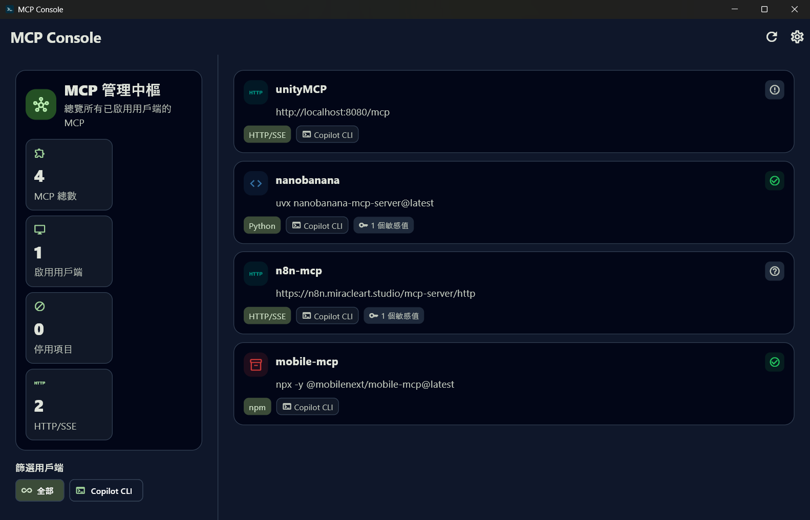

# MCP Console

<p align="center">
  
</p>

<p align="center">
  <strong>集中檢視、編輯與更新多個 AI 用戶端的 MCP 伺服器設定。</strong>
</p>

<p align="center">
  <a href="https://github.com/JiaDians/mcp_console/actions/workflows/ci.yml"></a>
  <a href="https://github.com/JiaDians/mcp_console/releases"></a>
  
</p>

MCP Console 是一款以 Windows 桌面為主的 Flutter 應用程式，會讀取已啟用 AI 用戶端的 MCP 設定檔，將同名伺服器合併成單一清單，並提供版本檢查、連線狀態、編輯與更新入口。



## 功能特色

- **多用戶端總覽**：集中管理 Claude Desktop、Cursor、Windsurf、VS Code 與 Copilot CLI 的 MCP 設定。
- **MCP 儀表板**：顯示 MCP 總數、啟用用戶端、停用項目與 HTTP/SSE 伺服器統計。
- **版本與連線檢查**：支援 npm、PyPI、GitHub release/tag/package.json fallback，以及 HTTP/SSE 連線探測。
- **一鍵更新**：依 MCP 類型執行 `npm`、`uv`、`pip` 或 `git pull`，成功後同步改寫設定檔版本。
- **完整設定編輯**：支援 stdio 的 `command`、`args`、`env`，以及 HTTP/SSE 的 `url`、`headers`、`timeout` 等欄位。
- **安全顯示敏感資訊**：環境變數與 HTTP headers 預設遮罩，需要時再手動顯示或複製。

## 下載與安裝

前往 [Releases](https://github.com/JiaDians/mcp_console/releases) 下載最新 Windows 版本。

| 檔案 | 適合情境 |
| --- | --- |
| `MCP_Console_v*_Setup.exe` | 建議使用；提供安裝流程、桌面捷徑與解除安裝入口 |
| `MCP_Console_v*_windows_portable.zip` | 免安裝；解壓縮後直接執行 |

> [!IMPORTANT]
> 首次執行時 Windows SmartScreen 可能顯示「Windows 已保護您的電腦」。這是因為目前尚未提供程式碼簽章。若你信任此開源專案，請點選「更多資訊」→「仍要執行」。

## 支援的設定來源

MCP Console 會自動尋找下列預設路徑，也可以在設定頁新增自訂設定檔路徑。

| 用戶端 | Windows 預設設定檔 |
| --- | --- |
| Claude Desktop | `%APPDATA%\Claude\claude_desktop_config.json` |
| Cursor | `%USERPROFILE%\.cursor\mcp.json` |
| Windsurf | `%USERPROFILE%\.codeium\windsurf\mcp_config.json` |
| VS Code | `%APPDATA%\Code\User\mcp.json` |
| Copilot CLI | `%USERPROFILE%\.copilot\mcp-config.json` |

> [!NOTE]
> MCP 名稱是主要識別鍵；同名 MCP 會被視為同一個伺服器，並合併顯示其來源用戶端。

## 本機開發

需求：

- Flutter 3.x，需啟用 Windows desktop 支援
- Dart SDK 3.x
- Windows 10 / 11 x64

安裝相依套件：

```powershell
flutter pub get
```

啟動桌面版：

```powershell
flutter run -d windows
```

執行檢查與測試：

```powershell
flutter analyze --no-fatal-infos
flutter test
```

建置發行版：

```powershell
flutter build windows --release
```

## 專案結構

| 路徑 | 說明 |
| --- | --- |
| `lib\ui` | 畫面與共用 UI 元件 |
| `lib\providers` | Riverpod 狀態與資料流 |
| `lib\services` | 設定解析、版本檢查、本機版本偵測與更新流程 |
| `lib\models` | AI 用戶端、MCP 伺服器與版本檢查結果模型 |
| `lib\core` | 主題、常數、工具與跨平台路徑 |
